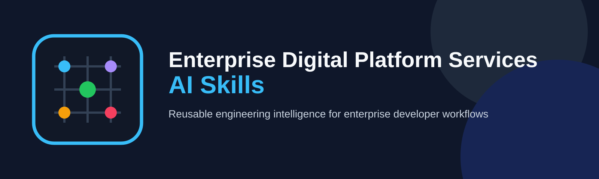

<p align="center">
  
</p>

<p align="center">
  <a href="https://github.com/javakishore-veleti/Enterprise-Digital-Platform-Services-AI-Skills/actions/workflows/validate.yml"></a>
  <a href="https://github.com/javakishore-veleti/Enterprise-Digital-Platform-Services-AI-Skills/actions/workflows/publish-github-package.yml"></a>
  
  
</p>

# Enterprise Digital Platform Services AI Skills

## Overview

**Enterprise Digital Platform Services AI Skills** is an installable enterprise engineering skill library for teams using AI coding assistants across large, heterogeneous application ecosystems.

Instead of asking every engineer to repeatedly invent prompts for Spring Boot, Python, Kubernetes, databases, messaging, observability, security, commerce, and cloud services, this repository captures that knowledge as **reusable, technology-qualified skills**. Engineers install the shared library on their development machine, work inside the real application repository, and invoke focused slash skills from supported AI development tools.

The model is intentionally split into three layers:

1. **Enterprise skills** define **how to investigate, reason about, build, troubleshoot, and operate a technology**.
2. **`.digital-platform-ai/` in each service repository** describes **that application's environments, dependencies, deployment repository, observability, security references, and service-specific instructions**.
3. **Runtime evidence** from source code, logs, traces, metrics, Kubernetes, databases, caches, message platforms, and other systems grounds the AI's conclusions.

This keeps enterprise engineering knowledge centralized and reusable while leaving application-specific context with the application that owns it.

### Why this repository exists

The approach grew from a broader **Prompt Engineering Operating Model for enterprise engineering teams**: move beyond isolated prompt snippets and establish reusable controls for instructions, context, reasoning, tool use, execution, and verification across many engineering teams and technologies.

Read the practical background and operating-model rationale:

**[Chief AI Architect Approaches — Prompt Engineering: An Operating Model for Enterprise Engineering Teams](https://productcognizant.com/chief-ai-architect-approaches-prompt-engineering-an-operating-model-for-enterprise-engineering-teams/)**

### What this repository provides

- Technology-specific slash skills with globally unambiguous names
- Capability-oriented Spring Boot skill families rather than one generic Spring folder
- Azure, AWS, Kubernetes, database, messaging, security, observability, AI/RAG, and commerce skills
- Service-context templates under `.digital-platform-ai/`
- Harness guidance for multiple AI coding environments
- GitHub Packages distribution and an `edp-ai-skills` installation/update CLI
- Validation and publishing workflows through GitHub Actions

## Operating Model

This repository separates reusable enterprise capability from service-specific context:

- **Enterprise AI Skills** define **HOW** AI works with technologies.
- **`.digital-platform-ai/`** inside each application repository defines the service's **WHAT / WHERE / DEPENDENCIES / INSTRUCTIONS**.
- **Runtime systems and engineering tools** provide the **EVIDENCE**.
- Engineers invoke installed slash skills from supported AI development harnesses while working inside the actual service repository.

## Install from GitHub Packages

The initial distribution channel is **GitHub Packages**.

### 1. Authenticate npm to GitHub Packages

Create or update your user-level `~/.npmrc`:

```properties
@javakishore-veleti:registry=https://npm.pkg.github.com
//npm.pkg.github.com/:_authToken=${GITHUB_PACKAGES_TOKEN}
```

Set `GITHUB_PACKAGES_TOKEN` to a GitHub token permitted to read packages.

### 2. Install the beta package globally

```bash
npm install -g @javakishore-veleti/enterprise-digital-platform-services-ai-skills@beta --registry=https://npm.pkg.github.com
```

### 3. Install the enterprise skills onto the developer machine

```bash
edp-ai-skills install
```

Default location:

```text
~/.enterprise-digital-platform-ai/
├── skills/
├── standards/
├── harnesses/
├── templates/
└── docs/
```

The skills are installed on the **developer machine**, not copied into every service repository.

### Update

```bash
npm update -g @javakishore-veleti/enterprise-digital-platform-services-ai-skills --registry=https://npm.pkg.github.com
edp-ai-skills update
```

### Useful CLI commands

```bash
edp-ai-skills list
edp-ai-skills doctor
edp-ai-skills path
edp-ai-skills install --target /custom/path
```

## Service Repository Context

Each service repository can contain:

```text
.digital-platform-ai/
├── service.yaml
├── dependencies.yaml
├── environments.yaml
├── observability.yaml
├── <technology>.yaml
├── ServiceInstructions-01.md
├── ServiceInstructions-02.md
└── ...
```

This keeps enterprise skills reusable while allowing each service to describe its own dependencies, runtime environments, operations repository, authentication references, observability, and service-specific instructions.

## Repository Structure

```text
skills/                         Reusable technology and capability skills
standards/                      Prompting, reasoning, investigation and verification standards
harnesses/                      Harness-specific integration guidance
templates/digital-platform-ai/  Service-repository metadata templates
docs/                           Operating model and architecture guidance
bin/                            Developer CLI
.github/workflows/              Validation and GitHub Packages publishing
assets/brand/                   Repository logo and banner
```

## Capability Examples

The repository contains enterprise skill families covering areas such as:

- Azure Kubernetes Service, Cosmos DB, Key Vault, Event Hubs, Azure Redis and Azure PostgreSQL
- Amazon MSK, AWS KMS, ElastiCache Redis/Valkey and related AWS data-platform capabilities
- Self-managed MongoDB and MongoDB Atlas
- Apache Kafka
- Datadog
- Drools
- Shopify Hydrogen
- Spring Boot capability families including web, security, data, observability, resilience, AI, GraphQL, gRPC, batch and integration

Public skill names are technology-qualified so commands remain unambiguous across a large enterprise ecosystem.

## GitHub Actions

- **Validate AI Skills** — validates skill structure, package contents and CLI behavior.
- **Publish GitHub Package** — publishes a package version to GitHub Packages from `main`; already-published versions are skipped.
- **Package Release Check** — builds the npm tarball for package-affecting pull requests.

## Package

```text
@javakishore-veleti/enterprise-digital-platform-services-ai-skills
```

Current channel: **beta**

## Design Principle

> Standardize the capability, not the AI client.

The same enterprise skill library is intended to support developer workflows across compatible AI coding harnesses without embedding service-specific configuration inside the shared skill package.
